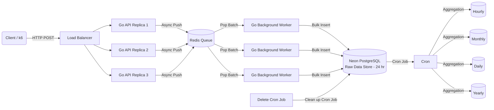

# 🚀 High-Throughput Distributed Analytics Engine


A high-concurrency event ingestion pipeline designed to handle massive traffic spikes. Built with **Golang**, this system uses an **asynchronous architecture** (API → Redis → Worker) to achieve sub-millisecond API latency while ensuring data consistency in **PostgreSQL**.

---

## 🏗️ Architecture

The system decouples **ingestion** from **processing** to ensure high availability and write speeds.



### Key Components
- Ingestion API (Go): Lightweight HTTP server. Accepts JSON events, validates them, and pushes them instantly to a Redis List. Zero database blocking.
- Message Queue (Redis): Acts as a shock absorber. Handles traffic spikes (e.g., 2k+ events/sec) without overwhelming the database.
- Worker Service (Go): Consumes messages from Redis, batches them (e.g., 2000 events/batch), and performs efficient bulk inserts into PostgreSQL.
- Cron Service: Handles periodic aggregation and cleanup tasks.

### Performance BenchmarksTested on a local single-node environment (Consumer Laptop) using k6.

| Metric | Single Instance | 3-Node Cluster (Optimized) | Description |
| :--- | :--- | :--- | :--- |
| **Throughput** | 1,578 Req/Sec | **1,626 Req/Sec** | Sustained load over 2 minutes. |
| **Latency (p95)** | 5.45 ms | **1.23 ms** ⚡ | 95% of requests completed in < 1.3ms. |
| **Reliability** | 100% | **100%** | Zero dropped requests under load. |
| **Capacity** | 136M / Day | **140M+ / Day** | Extrapolated daily volume. |
    
    
    
## Tech Stack
- **Language**: Golang (1.21+) 
- **Database**: PostgreSQL (via Neon Serverless)
- **Queue**: Redis 
- **Containerization**: Docker & Docker Compose 
- **Testing**: Grafana k6

## Project Structure
``` bash
.
├── cmd/
│   ├── api/          
│   ├── worker/      
│   └── cron/         
├── internal/
│   └── queue/        
├── docker-compose.yml 
├── Dockerfile        
└── loadtest.js       
```

## Future Improvements
- **Batching**: Implement dynamic batching in the API layer for even higher throughput.
- **Partitioning**: Use PostgreSQL partitioning for time-series data management.

Author
Agniva Sengupta Building scalable systems one goroutine at a time.